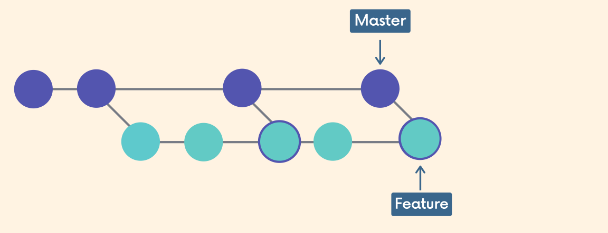
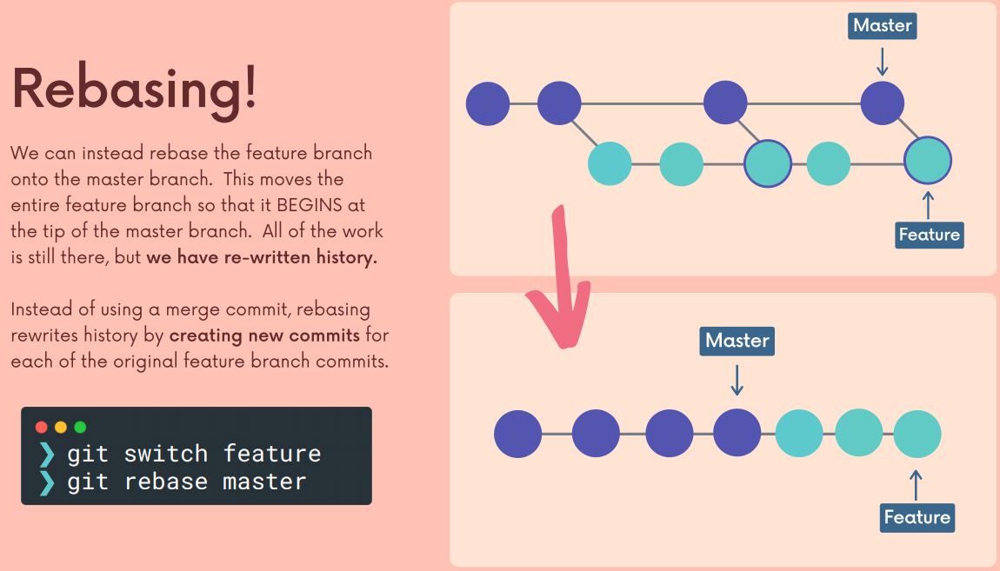

# In this section, i will be discussing the rebase command in git:

- Scary command at first ...
- Very useful command, as long as you know when **NOT** to use it

# git merge and git rebase

- Both commands are used to integrate changes from one branch into another branch.

- There are two main ways to use the git rebase command:
  - as an alternative to the git merge command
  - to clean up your commit history

# Scenario:

- I make a feature branch ...

- ...and do some work on that

> But the master has a new work on it!!!!

- The change can come from another developer working on their own feature...
- Any pull request that was merged into the master branch...

### I want to get the latest changes from the master branch into my feature branch

> I can use the git merge command

### How about the master is very active, and i want to keep my feature branch up-to-date with the master branch?

> Keep using the git merge command

- So the problem is that the commit history is not clean anymore, with the
  meaningless merge commits

# That why we use the git rebase command

> Rebase: we came up with the "base" of the "feature" branch at the top of the "master" branch

# My demo

- Rebase de lay thong tin
- Hoac cu dung merge nhu binh thuong, nhung khi review se rebase lai => mat het commit merge

# The golden rule When NOT to use rebase

- Never rebase commits that have been shared with others.
- If you have already pushed commits up to Github... **DO NOT** rebase them unless you are
  positive no one on the team is using those commits
  > Mean, you want to be rebasing commits that you have on your machine and other people dont't,
  > in your feature branch, you do new feature, fix some bug, and you rebase the current brach to
  > master (or another branch), just changing the history at my current branch, do not affect
  > with master
  > Once you pushed that feature branch up, if somebody has pulled that down(you did rebasing on that,
  > dont.......)

# Depend on your workflow ~

- Rebase all time
- Only Merge

# Handling the conflicts
